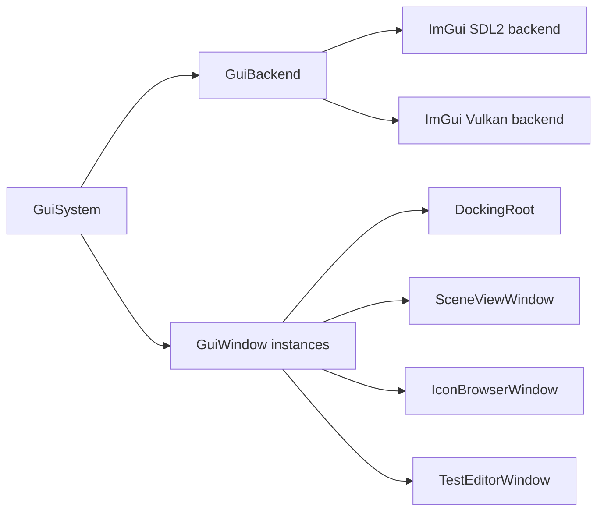

# Editor Application

The editor executable is the primary application target today. It launches the engine, registers editor systems, and creates an ImGui docking interface.

## Entry Point

`Editor/Editor.cpp`:

1. Creates `gns::core::EngineConfig`.
2. Enables windowed mode.
3. Enables the test system flag.
4. Creates `gns::core::Engine`.
5. Registers editor systems and windows in the initialization callback.
6. Runs the engine loop.
7. Shuts down the engine.

## Editor Systems

### EditorCameraSystem

`EditorCameraSystem` drives the render camera.

Current controls:

- Hold mouse button `3` to rotate/move.
- `W` and `S` move forward/back.
- `A` and `D` move left/right.
- `E` and `Q` move up/down.

The system updates camera aspect from `RenderSystem::GetScreen`, writes view/projection matrices into `CameraBackend`, and passes them to the renderer each frame.

### TestSystemExternal

The editor registers `TestSystemExternal` as a sample external system. It is useful as a small integration point for systems outside the engine library.

## GUI Stack

The GUI path is:

`GuiSystem` owns registered `GuiWindow` instances and drives window drawing between `GuiBackend::BeginGuiFrame` and `GuiBackend::OnEndGuiFrame`.

## DockingRoot

`DockingRoot` creates the full-screen root ImGui window, custom borderless title bar, menu bar, and dockspace.

The title bar buttons call the public window API:

- `gns::window::MinimizeMainWindow`
- `gns::window::ToggleMaximizeMainWindow`
- `gns::window::RequestCloseMainWindow`

## SceneViewWindow

`SceneViewWindow` uses the available ImGui content region as the scene viewport. It:

1. Builds a `gns::Screen` from cursor position and available size.
2. Sends that screen rectangle to `GuiSystem::SetSceneScreen`.
3. Fetches the scene texture descriptor.
4. Draws the scene texture through `ImGui::Image`.

This is how editor viewport size influences the renderer render extent.

## GUI Backend

`GuiBackend` initializes:

- ImGui context
- SDL2 ImGui backend
- Vulkan ImGui backend
- Descriptor pool
- Docking and multi-viewport flags
- Editor fonts
- Genesis editor style

`GuiBackend::DrawImGui` records ImGui draw data into the active Vulkan command buffer using dynamic rendering.

## Borderless Window Support

The SDL window is created with `SDL_WINDOW_BORDERLESS`. Window movement and resizing are implemented through:

- SDL hit testing in `Window.cpp`
- Manual resize cursor and capture logic in `InputBackend.cpp`
- custom title bar buttons in `DockingRoot.cpp`
