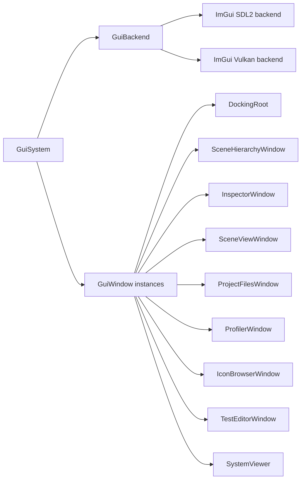

# Editor Application

The editor executable is the primary application target today. It launches the engine, registers editor systems, validates project paths, and creates an ImGui docking interface.

## Entry Point

`Editor/Editor.cpp`:

1. Creates `gns::core::EngineConfig`.
2. Enables windowed mode.
3. Enables the current dev/test system flag.
4. Reads `-p` / `--project` and `-r` / `--resources` command-line paths into the engine config.
5. Creates `gns::core::Engine`.
6. Validates the project context in the initialization callback.
7. Registers editor systems and windows.
8. Runs the engine loop.
9. Shuts down the engine.

## Editor Systems

### EditorCameraSystem

`EditorCameraSystem` drives the render camera.

Current controls:

- Hold mouse button `3` to rotate/move.
- `W` and `S` move forward/back.
- `A` and `D` move left/right.
- `E` and `Q` move up/down.

The system updates camera aspect from `WindowSystem::GetScreen`, writes view/projection matrices into `CameraBackend`, and passes them to the renderer each frame.

### TestSystemExternal

The editor registers `TestSystemExternal` as a sample external system. It is useful as a small integration point for systems outside the engine library.

### What Is Not A System

Editor windows such as `SystemViewer`, `SceneViewWindow`, and `ProjectFilesWindow` are `GuiWindow` instances registered with `GuiSystem`. They are public UI interaction points, but they are not runtime systems because they do not derive from `gns::core::System` or register with `SystemsManager`.

## GUI Stack

The GUI path is:

`GuiSystem` owns registered `GuiWindow` instances and drives window drawing between `GuiBackend::BeginGuiFrame` and `GuiBackend::OnEndGuiFrame`.

## DockingRoot

`DockingRoot` creates the full-screen root ImGui window, custom borderless title bar, menu bar, and dockspace.

The title bar buttons call the public window API:

- `gns::window::MinimizeMainWindow`
- `gns::window::ToggleMaximizeMainWindow`
- `gns::window::RequestCloseMainWindow`

## SceneViewWindow

`SceneViewWindow` uses the available ImGui content region as the scene viewport. It:

1. Builds a `gns::Screen` from cursor position and available size.
2. Sends that screen rectangle to `GuiSystem::SetSceneScreen`.
3. Fetches the scene texture descriptor.
4. Draws the scene texture through `ImGui::Image`.

This is how editor viewport size influences the renderer render extent.

Scene asset drag/drop now delegates model import state to `Editor/Assets/ModelImportController` and scene insertion to `SceneAssetImporter` instead of keeping the full import flow inside the viewport window.

## ProjectFilesWindow

`ProjectFilesWindow` browses the configured project assets directory through `EditorProjectContext` and `ProjectFilesModel`. It supports meta-file filtering, file selection, asset drag/drop payloads, and model import metadata generation.

## Inspector and Hierarchy

`SceneHierarchyWindow` displays scene/entity hierarchy state. `InspectorWindow` uses component reflection metadata to inspect and edit selected entities and material/resource state where supported.

## SystemViewer and Profiler

`SystemViewer` visualizes registered runtime systems from `SystemsManager`. `ProfilerWindow` writes profiler captures under the configured project cache root.

## GUI Backend

`GuiBackend` initializes:

- ImGui context
- SDL2 ImGui backend
- Vulkan ImGui backend
- Descriptor pool
- Docking and multi-viewport flags
- Editor fonts
- Genesis editor style

`GuiBackend::DrawImGui` records ImGui draw data into the active Vulkan command buffer using dynamic rendering.

## Borderless Window Support

The SDL window is created with `SDL_WINDOW_BORDERLESS`. Window movement and resizing are implemented through:

- SDL hit testing in `Window.cpp`
- Manual resize cursor and capture logic in `InputBackend.cpp`
- custom title bar buttons in `DockingRoot.cpp`
