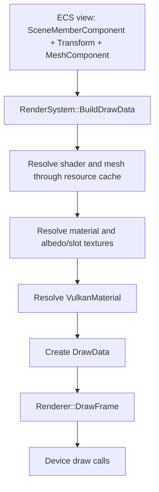

# Renderer and Resource Ownership

GenesisEngine is a Vulkan-only renderer. The most important architectural rule is the boundary between engine resources and Vulkan resources.

## Ownership Boundary


Engine objects own engine data:

- `Mesh`
- `Texture`
- `Material`
- `Shader`

Vulkan objects own backend data:

- `VulkanMesh`
- `VulkanTexture`
- `VulkanShader`
- `VulkanMaterial`
- `VulkanImage`
- `VulkanBuffer`

`RenderSystem` is the bridge and public render-system API. It is the only layer that should know both engine object handles and Vulkan resource handles.

## RenderSystem

`Engine/Renderer/RenderSystem.h` contains `RenderResourceCache`:

```cpp
struct RenderResourceCache
{
    std::unordered_map<Handle, Handle> meshes;
    std::unordered_map<Handle, Handle> shaders;
    std::unordered_map<Handle, Handle> textures;
    std::unordered_map<Handle, Handle> materials;
};
```

Each map uses an engine object handle as the key and a renderer/Vulkan handle as the value.

The public apply functions are:

- `ApplyMesh(Mesh& mesh)`
- `ApplyShader(Shader& shader)`
- `ApplyTexture(Texture& texture)`
- `ApplyMaterial(Material& material)`

These functions check the cache first. If a resource is not cached, they queue upload work into a `RenderUploadQueue`; the render thread later flushes that work and updates the cache after successful backend creation.

## Renderer

`Engine/Renderer/Renderer.h` is a facade over:

- `Device`
- `RenderGraph`
- Camera state
- Scene/screen texture access

It owns render pass setup and frame drawing. It creates Vulkan resources by delegating to `Device`. `RenderSystem` is a friend so it can coordinate camera state, device material creation, and resource lookup without exposing those internals as a broad public API.

Current render pass order:

1. Transition draw image to general.
2. Draw background.
3. Transition draw image and depth image for attachments.
4. Draw geometry.
5. Either copy scene to the swapchain or prepare the draw image for shader read.
6. Clear swapchain.
7. Draw ImGui.
8. Present.

## RenderGraph

`RenderGraph` is a lightweight ordered list of named render steps. Each step receives:

- `VkCommandBuffer`
- mutable `RenderStepData`
- per-frame `FrameData`

It currently executes steps linearly in insertion order.

## Device

`Device` owns Vulkan initialization and lifetime:

- Vulkan instance, debug messenger, surface, physical device, logical device
- VMA allocator
- swapchain
- frame command pools and command buffers
- synchronization objects
- descriptor allocators and layouts
- draw/depth images
- default textures
- immediate-submit command objects
- `VulkanResourceRegistry`

It is the lowest engine-owned layer that should directly create and destroy Vulkan resources.

## Render Thread and Uploads

`RenderSystem` owns a `RenderThread`, a `RenderFramePacket`, and pending upload queues. Its update flow is:

1. `OnUpdate` waits for/drains completed render submissions and requeues unfinished uploads.
2. `OnLateUpdate` builds draw data and global frame descriptors from ECS state.
3. The frame packet and pending uploads are submitted to the render thread.
4. The render thread flushes shader, mesh, texture, and material uploads before drawing the frame.

This means an `Apply*` call may return an invalid handle when it queued work rather than finding an already-created backend resource. Callers should treat the cache/getter functions as the source of truth after uploads complete.

## Draw Data Flow



`DrawData` carries the Vulkan shader, Vulkan material, index buffer, vertex buffer address, transform, and draw range required by the backend draw call.

## Default Textures

The renderer creates Vulkan default textures. `RenderSystem` registers engine-side `Texture` objects for them and stores mappings to the Vulkan texture handles.

Default texture handles:

- White
- Grey
- Black
- Normal
- Error checkerboard

## Important Constraints

- Do not add Vulkan handles to engine-side `Mesh`, `Texture`, `Material`, or `Shader`.
- Keep engine resource handle to Vulkan resource handle mapping in `RenderSystem` or a renderer-facing cache.
- Keep `Device` responsible for Vulkan object lifetime.
- Keep renderer development Vulkan-only. Do not introduce a generic multi-backend abstraction unless the project direction changes.
- Render-facing APIs may be public, but the system boundary remains `Engine resource handle -> RenderSystem cache -> Vulkan resource handle`.
