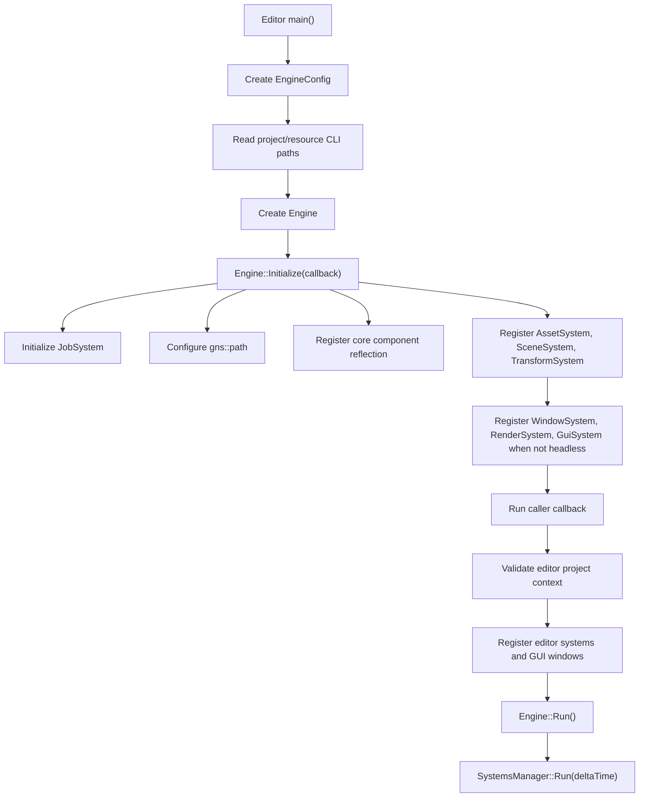
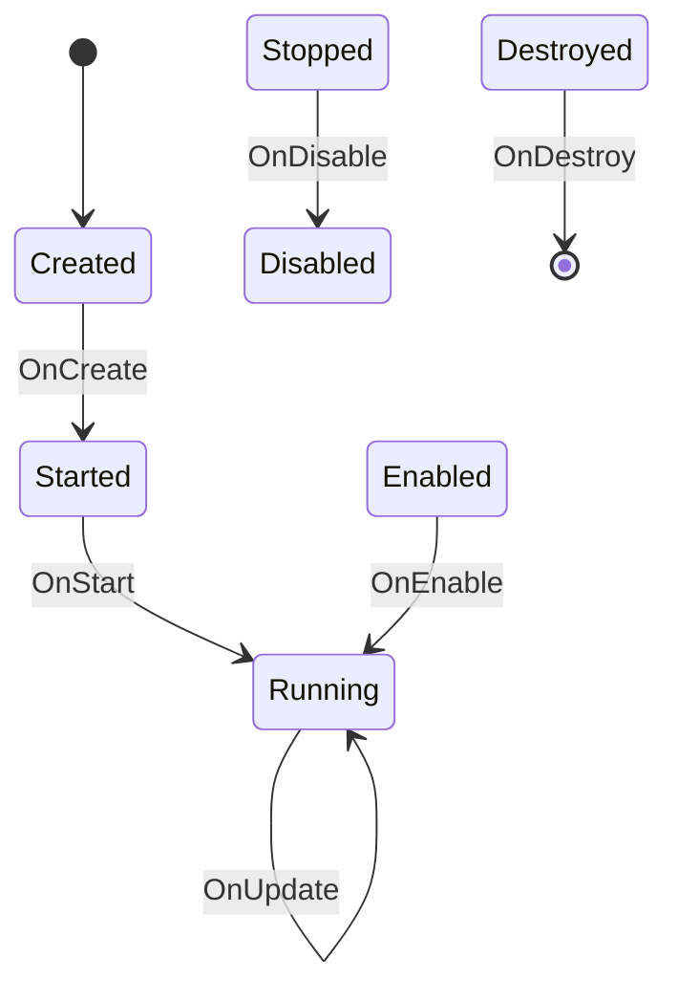

# Runtime Architecture

The runtime is built around a small `Engine` class, a global `SystemsManager`, EnTT entities/components, a central path API, a job system, and runtime systems derived from `gns::core::System`.

A runtime system is specifically a class that derives from `gns::core::System` and is registered through `SystemsManager::RegisterSystem`. Names alone do not make something a system: `SystemsManager`, `JobSystem`, and `SystemViewer` are not runtime systems even though their names contain `System`.

## Boot Flow

`Editor/Editor.cpp` is the current application entry point. It creates an `EngineConfig`, resolves project and editor-resource roots from command-line arguments, initializes the engine with an editor callback, runs the main loop, and then shuts down systems.

## Engine

`Engine/Engine.h` exposes:

- `Initialize(std::function<void()> callback)`
- `Run()`
- `ShutDown()`
- `GetWindow()`
- `GetRenderer()`

`Engine::Initialize` performs the core startup:

- Initializes `JobSystem`.
- Configures project and editor-resource roots through `gns::path::Configure`.
- Registers core component reflection.
- Always registers `AssetSystem`, `SceneSystem`, and `TransformSystem`.
- In windowed mode, registers `WindowSystem`, `RenderSystem`, and `GuiSystem`.
- Optionally registers `TestSystem` when `EngineConfig::InitTetsSystem` is enabled.
- Runs the caller callback so applications can register their own systems and GUI windows.
- Registers `TestWindow` when GUI is available.

## System Lifecycle

Systems derive from `gns::core::System` and can override:

- `OnCreate`
- `OnStart`
- `OnEnable`
- `OnUpdate`
- `OnLateUpdate`
- `OnFixedUpdate`
- `OnDisable`
- `OnDestroy`

`SystemsManager::Run` advances each registered system through the state machine:

Only registered systems participate in this lifecycle. After at least one system reaches `Running` and receives `OnUpdate`, the manager runs `OnLateUpdate` for all running systems. `SystemsManager::Clear` calls `OnDestroy` on every registered system and clears the system list.

Current registered system types include:

- Engine/core: `AssetSystem`, `SceneSystem`, `TransformSystem`, `WindowSystem`, `RenderSystem`, `GuiSystem`, and optional `TestSystem`.
- Editor: `TestSystemExternal` and `EditorCameraSystem`.

## ECS Model

Entities are thin wrappers around `entt::entity` handles. The global `entt::registry` lives in `SystemsManager`.

`Entity::CreateEntity` currently creates:

- `EntityComponent`
- `Transform`
- `SceneMemberComponent` and `HierarchyComponent` when scene/parent context is supplied.

Main components currently defined in `Engine/Core/ComponentLibrary.h`:

- `EntityComponent`: entity handle and display name.
- `SceneRootComponent`: marks a scene root entity.
- `SceneMemberComponent`: records which loaded scene owns an entity.
- `HierarchyComponent`: parent/child hierarchy state.
- `Transform`: matrix, position, rotation, and scale.
- `MeshComponent`: references to engine-side mesh and material objects.
- `AmbientLightComponent`, `DirectionalLightComponent`, `PointLightComponent`, and `SpotLightComponent`: scene lighting data consumed by the render system.

## Object and Handle Model

`gns::Handle` is a 64-bit value. Handles are either random values from `Handle::New` or deterministic FNV-1a hashes from `Handle::CreateFromString`.

`gns::Object` is the base for engine-side asset objects. It owns:

- A handle
- A name
- Static object lookup storage
- Deferred deletion queue

Engine-side objects currently include:

- `Mesh`
- `Texture`
- `Material`
- `Shader`

`Reference<T>` stores a `Handle` plus a type id and is used by components and material state to point at engine objects.

## Scene Model

`Scene` currently contains:

- `name`
- `root`
- `handle`

`SceneManager` owns loaded scenes and the active-scene pointer. `SceneSystem::OnStart` creates an empty scene when no active scene exists, and `SceneSystem::OnUpdate` advances pending scene asset imports.

`SceneData` is render-frame GPU data assembled by `RenderSystem` from camera and light components. Rendering pulls from the global ECS registry, filtering mesh and light entities by `SceneMemberComponent` and loaded-scene state.
