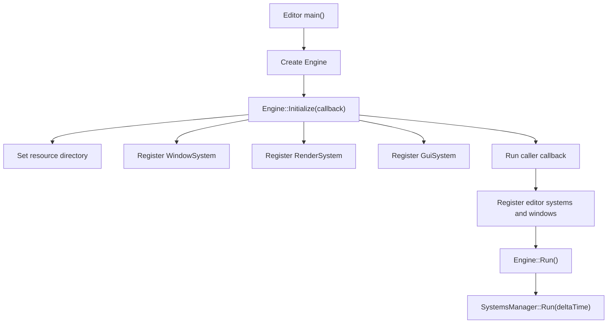
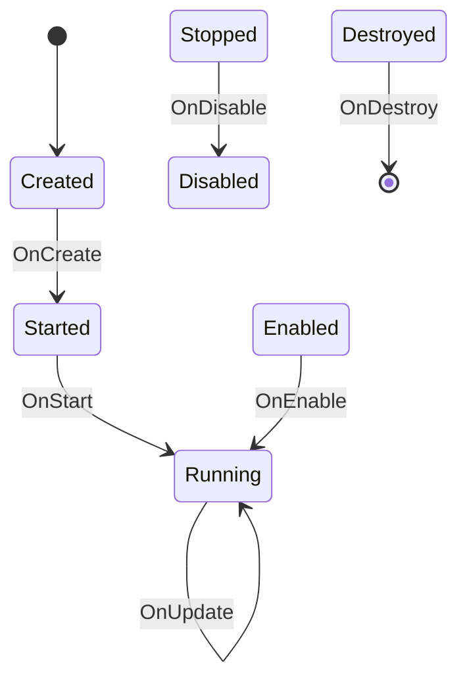

# Runtime Architecture

The runtime is built around a small `Engine` class, a global `SystemsManager`, EnTT entities/components, and subsystem classes derived from `gns::core::System`.

## Boot Flow

`Editor/Editor.cpp` is the current application entry point. It creates an `EngineConfig`, initializes the engine with an editor callback, runs the main loop, and then shuts down systems.

## Engine

`Engine/Engine.h` exposes:

- `Initialize(std::function<void()> callback)`
- `Run()`
- `ShutDown()`
- `GetWindow()`
- `GetRenderer()`

`Engine::Initialize` registers core systems when not headless:

- `WindowSystem`
- `RenderSystem`
- `GuiSystem`

It also optionally registers `TestSystem` and then invokes the caller callback so applications can register their own systems and GUI windows.

## System Lifecycle

Systems derive from `gns::core::System` and can override:

- `OnCreate`
- `OnStart`
- `OnEnable`
- `OnUpdate`
- `OnLateUpdate`
- `OnFixedUpdate`
- `OnDisable`
- `OnDestroy`

`SystemsManager::Run` advances each system through the state machine:

After at least one system reaches `Running` and receives `OnUpdate`, the manager runs `OnLateUpdate` for all running systems.

## ECS Model

Entities are thin wrappers around `entt::entity` handles. The global `entt::registry` lives in `SystemsManager`.

`Entity::CreateEntity` currently creates:

- `EntityComponent`
- `Transform`

Main components currently defined in `Engine/Core/ComponentLibrary.h`:

- `EntityComponent`: entity handle and display name.
- `Transform`: matrix, position, rotation, and scale.
- `MeshComponent`: references to engine-side mesh, material, and shader objects.

## Object and Handle Model

`gns::Handle` is a 64-bit value. Handles are either random values from `Handle::New` or deterministic FNV-1a hashes from `Handle::CreateFromString`.

`gns::Object` is the base for engine-side asset objects. It owns:

- A handle
- A name
- Static object lookup storage
- Deferred deletion queue

Engine-side objects currently include:

- `Mesh`
- `Texture`
- `Material`
- `Shader`

`Reference<T>` stores a `Handle` plus a type id and is used by components and material state to point at engine objects.

## Scene Model

`Scene` currently contains:

- `name`
- `root`
- `SceneData`

`SceneData` stores view/projection matrices and simple ambient/sunlight fields intended for GPU upload.

The scene layer is still early. Most rendering currently pulls from the global ECS registry rather than a richer scene hierarchy.
